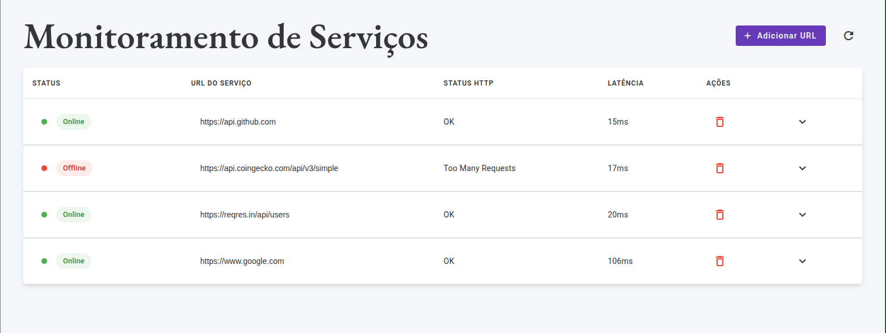

      
       

# Go Health Checker

O **Go Health Checker** é uma aplicação de monitoramento do status de saúde de URLs. Ele permite que os usuários insiram URLs e verifiquem se os serviços estão online, o tempo de latência e o status HTTP. A aplicação é construída com um backend em **Go** e um frontend em **Angular**.

## Resultado ✨

- **Você pode conferir o resultado nos seguintes locais:**
  - **[Front - VERCEL](https://go-health-checker.vercel.app/)**
  - **[Backend - RENDER](https://go-healthchecker.onrender.com)**



> Nota: O acesso aos links pode conter instabilidade por estarem hospedados em serviços gratuitos. **Para uma melhor experiência rode localmente**.

## Funcionalidades

- **Verificação de Status de URL:** Verifica o status de uma lista de URLs de forma concorrente, aproveitando o poder das goroutines em Go.
- **Adicionar e Remover URLs:** Interface intuitiva para adicionar e remover URLs da lista de monitoramento.
- **Edição de URL:** Permite a alteração de uma URL diretamente na tabela de exibição.
- **Detalhes da Verificação:** Exibe o status (Online/Offline), o código e a mensagem de status HTTP, e a latência em milissegundos para cada URL.-
- **Atualização em Tempo Real:** Permite que os usuários atualizem o status de todas as URLs com um único clique.
- **Feedback Visual:** Utiliza indicadores de cor e ícones para um entendimento rápido do status dos serviços.

## Stack 🚀

**Backend**

- **Go** 💙
- **Goroutines**
- **API RESTful**

**Frontend**

- **Angular (v20)**
- **Angular Material**
- **RxJS**

## Rodando a aplicação ⚡️

> 1. **Para instruções de como rodar o projeto manualmente (sem Docker), veja o arquivo [RUN_MANUALLY.md](./RUN_MANUALLY.md).**
> 2. Para rodar a aplicação localmente utilizando Docker, siga os passos **abaixo** ⬇️:

### 📋 Pré-requisitos

Certifique-se de que você tem o [Docker](https://www.docker.com/get-started) e o [Docker Compose](https://docs.docker.com/compose/install/) instalados em sua máquina.

1.  Clone o repositório:

    ```bash
    git clone https://github.com/dev-araujo/go-healthchecker.git
    ```

2.  Execute o Docker Compose para construir as imagens e iniciar os contêineres:
    ```bash
    docker-compose up --build -d
    ```

A aplicação estará disponível nos seguintes endereços:

- **Frontend:** `http://localhost:4200`
- **Backend:** `http://localhost:8080`

---

## ⚙️ API

A aplicação utiliza uma API RESTful simples para a comunicação entre o frontend e o backend.

### Endpoint de Verificação de Saúde

- **Endpoint:** `/check`
- **Método:** `POST`
- **Descrição:** Recebe uma lista de URLs e retorna o status de saúde de cada uma.
- **Payload da Requisição:**
  ```json
  {
    "urls": ["https://www.google.com", "https://api.github.com"]
  }
  ```
- **Resposta de Sucesso:**
  ```json
  {
    "status": "success",
    "checkedAt": "2024-07-18T19:55:41.134324Z",
    "durationSeconds": 0.2223,
    "summary": {
      "total": 4,
      "successful": 2,
      "failed": 2
    },
    "results": [
      {
        "url": "https://httpstat.us/500",
        "isUp": false,
        "statusCode": 500,
        "statusText": "Internal Server Error",
        "latencyMs": 221,
        "error": "500 Internal Server Error"
      },
      {
        "url": "https://www.google.com",
        "isUp": true,
        "statusCode": 200,
        "statusText": "OK",
        "latencyMs": 59
      },
      {
        "url": "https://api.github.com",
        "isUp": true,
        "statusCode": 200,
        "statusText": "OK",
        "latencyMs": 105
      },
      {
        "url": "https://httpstat.us/404",
        "isUp": false,
        "statusCode": 404,
        "statusText": "Not Found",
        "latencyMs": 218,
        "error": "404 Not Found"
      }
    ]
  }
  ```

---

#### Autor 👷


[Adriano P Araujo](https://www.linkedin.com/in/araujocode/)
